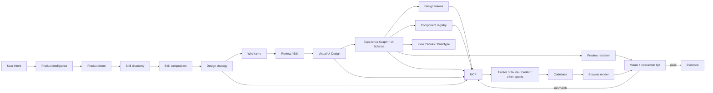
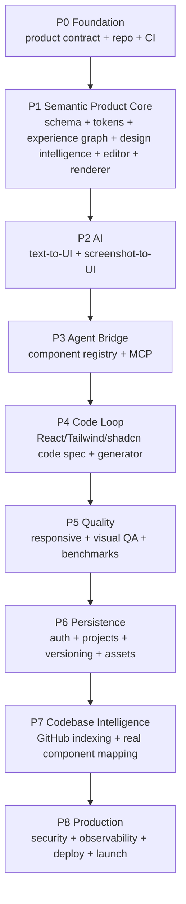

# UIForge

> **Design once. Let agents build it.**

UIForge is an AI-native product experience, UI specification and design workspace built for software agents.

Instead of treating a canvas as the source of truth, UIForge treats a **versioned UI Schema + Product Experience Graph** as the canonical domain contract. The UI Schema describes what screens and components are; the Experience Graph describes how users move between them. Canvas, AI, prototype, renderers, code generators, and MCP are projections of those semantic models.

## Why UIForge exists

Most design-to-code workflows lose information between design and implementation:

- visual layout becomes an ambiguous screenshot;
- design tokens become hard-coded values;
- components are recreated instead of mapped to the real codebase;
- responsive rules disappear;
- AI agents receive too much raw canvas data and too little semantic context;
- visual regressions are discovered only after implementation.

UIForge is designed around a different contract:

`User Intent → Product Intent → Skill Discovery → Skill Composition → Design Strategy → Wireframe → Review/Edit → Visual UI Design → Design System → Canvas/Prototype → MCP → Agent → Code → Visual + Interaction QA → Fix`

The product is **not** "another AI UI generator". Its core asset is a machine-readable UI specification that humans can edit visually and agents can consume deterministically.

## Product principles

1. **Semantic core first** — Product Intent, Design Strategy, UI Schema and Product Experience Graph are explicit, versioned contracts.
2. **Design intelligence first** — AI selects and composes reusable UI/UX skills before generating screens.
3. **Schema first** — the UI Schema and Experience Graph are the canonical representation.
4. **Renderer independent** — tldraw is an editor adapter, not the persistence model.
5. **Provider independent** — AI providers are behind stable contracts.
6. **Human controlled** — AI proposes/apply changes with inspectable diffs.
7. **Evidence driven** — a feature is not complete until tests and real artifacts prove it.
8. **Small modules** — avoid monolithic editor, AI, MCP, or persistence files.
9. **Deterministic where possible** — fixtures, snapshots, seeded examples, stable rendering.
10. **Progressive complexity** — MVP solves one complete product-flow loop before adding collaboration or multi-framework codegen.
11. **Flow first-class** — a screen is not a complete product specification; every meaningful journey must be representable as semantic transitions.
12. **Skill-driven design** — domain knowledge, UX patterns, interaction patterns, responsive rules and accessibility constraints live in reusable, composable skills rather than giant model prompts.

## Core workflow



## Phase roadmap



## MVP definition

The first credible MVP is complete when a user can:

1. create a project;
2. define or infer Product Intent;
3. discover and compose relevant design skills;
4. generate/review a Design Strategy;
5. establish the project Color Strategy;
6. define or generate a user journey/flow;
7. describe a screen in natural language;
8. generate an editable UI;
9. inspect its semantic layer tree;
10. edit components/tokens manually;
11. expose the design through a remote MCP endpoint;
12. ask an agent to implement the screen in React + Tailwind + shadcn/ui;
13. render the implementation in a browser;
14. verify the implementation follows the intended navigation and interaction flow;
15. compare it against the design;
16. produce evidence showing the design-to-code and flow loop works.

## Target architecture

```
apps/
  web/                 # Next.js product/editor
  mcp-server/          # remote MCP server

packages/
  ui-schema/            # canonical screen/node schema + validators
  experience-graph/     # flows, journeys, transitions and graph validation
  design-intelligence/  # skill registry, discovery, composition and design strategy
  design-tokens/        # token model + resolution
  component-registry/   # semantic components + code mappings
  editor/               # tldraw adapter and editor commands
  renderer/             # schema -> deterministic web preview
  ai/                   # provider-independent AI orchestration
  codegen/              # code specs and React/Tailwind generation
  visual-qa/            # screenshot/render comparison
  shared/               # contracts and utilities

docs/
  architecture/
  design-system/
  mcp/
  research/
  roadmap/
  operations/
```

## Technology baseline

- **TypeScript** end-to-end.
- **Next.js App Router** for the web application.
- **React 19.3** baseline.
- **Tailwind CSS v4** for the product UI and generated web target.
- **shadcn/ui + Base UI** as the default implementation component foundation, while keeping the registry abstraction framework/library neutral.
- **tldraw** as the interactive canvas/editor adapter.
- **Zustand** for local editor state where React state is insufficient.
- **TanStack Query** for server state.
- **Supabase/Postgres** for persistence/auth/storage in the initial hosted architecture.
- **MCP TypeScript SDK v2** (`@modelcontextprotocol/server` + client package) for the agent bridge.
- **AI SDK** for model/provider orchestration.
- **Playwright** for browser and visual regression testing.
- **Vitest** for unit/contract tests.
- **pnpm workspaces + Turborepo** for the monorepo.
- **GitHub Actions** for CI.

Technology choices are intentionally replaceable behind package contracts.

## MCP contract

The MCP server will expose three categories:

### Resources

- `ui://project`
- `ui://design-strategy`
- `ui://design-skills`
- `ui://color-strategy`
- `ui://screens`
- `ui://screen/{id}`
- `ui://component/{id}`
- `ui://tokens`
- `ui://assets`
- `ui://flows`
- `ui://flow/{id}`
- `ui://journey/{id}`
- `ui://screen/{id}/connections`

### Read tools

- `get_project`
- `get_design_strategy`
- `get_design_skills`
- `get_color_strategy`
- `get_screen`
- `get_layout_tree`
- `get_component`
- `get_component_registry`
- `get_design_tokens`
- `get_code_mapping`
- `get_responsive_rules`
- `get_code_spec`
- `get_flows`
- `get_flow`
- `get_user_journey`
- `get_transitions`
- `get_screen_connections`
- `get_navigation_map`
- `validate_design`
- `validate_flow`

### Mutation tools

Mutations are gated and auditable:

- `create_screen`
- `update_screen`
- `create_component_instance`
- `update_node`
- `move_node`
- `update_token`
- `create_transition`
- `update_transition`
- `delete_transition`

Production mutation requires explicit project capability and an audit trail.

MCP follows the protocol's Resources/Tools/Prompts model. Hosted production uses the current Streamable HTTP transport and the MCP TypeScript SDK v2 packages (`@modelcontextprotocol/server`, `@modelcontextprotocol/client`).

## Design consistency rules

The design system is governed by `docs/design-system/RULES.md`.

At minimum:

- no arbitrary spacing when a semantic spacing token exists;
- no arbitrary colors outside documented semantic tokens;
- typography uses a defined scale;
- radii, shadows, borders and controls use tokens;
- components have semantic names and variants;
- layout uses constraints/grid/flex semantics, not only absolute coordinates;
- mobile/tablet/desktop behavior is explicit;
- interactive states are defined;
- interactive triggers and destinations are explicitly modeled;
- navigation/overlay/state transitions have valid destinations;
- accessibility semantics are retained;
- code mappings are part of the component contract;
- AI-generated changes must preserve existing design-system invariants.

## Quality gate

A feature is not "done" because TypeScript compiles.

The completion gate is:

`Implement → Unit/Contract Tests → CI → Real Runtime → Artifact → Visual/Behavior Inspection → PR CI → Main CI → Evidence Comment → Close Issue`

Required evidence depends on the feature:

- screenshots for visual UI changes;
- schema fixture/output for schema changes;
- MCP request/response transcript for MCP changes;
- generated code + build/test output for codegen;
- Playwright screenshots/diff for visual QA;
- production-like runtime output for end-to-end features.

## Risk strategy

High-risk areas are isolated behind contracts:

| Risk | Mitigation |
|---|---|
| AI produces inconsistent UI | schema validation + constrained component registry + deterministic post-processing |
| Canvas becomes source of truth | schema-first architecture; tldraw adapter only |
| MCP context becomes huge | semantic, scoped resources/tools + pagination/selection |
| MCP mutation is unsafe | capability flags + validation + audit log + idempotency |
| Provider lock-in | AIProvider interface and model metadata |
| Visual tests flaky | pinned browser/runtime + stable fixtures + controlled fonts/data |
| Design drift | tokens + registry + visual QA |
| Codegen creates duplicate components | code mapping + project registry |
| Schema evolves incompatibly | versioned schema + migrations + fixtures |
| Multi-tenant data leak | Postgres RLS + server-side authorization + negative tests |
| Large editor becomes slow | normalized state + spatial queries + incremental rendering |
| Vendor API changes | adapter packages + contract tests + version pinning |

## Development workflow

1. Read the relevant issue and linked architecture docs.
2. Do not implement outside the issue scope.
3. Write/update tests before or with implementation.
4. Keep files small and responsibilities explicit.
5. Run local tests and real runtime verification.
6. Attach evidence to the PR/issue.
7. Verify CI artifacts.
8. Merge only after required gates pass.
9. Re-verify main branch before closing the issue.

See [AGENTS.md](AGENTS.md) for the full agent contract.

## Current status

This repository starts as a specification-first foundation. Implementation should follow the numbered GitHub issues in dependency order.

## Research references

- Model Context Protocol specification and 2026 updates.
- Figma MCP demonstrates the market direction of structured design context and write-back.
- tldraw provides AI/editor integration patterns and LLM-oriented documentation.
- React 19.3 is the current React major/minor baseline in the official docs.
- Tailwind CSS v4 provides CSS-first tokens, modern browser primitives and container queries.
- shadcn/ui is open-code and explicitly AI-ready; new projects default to Base UI as of July 2026.
- Supabase recommends RLS for exposed tables and explicit security tests.
- Playwright supports deterministic screenshot comparison with `toHaveScreenshot`.

## Official references

- Model Context Protocol: https://modelcontextprotocol.io/
- MCP TypeScript SDK v2: https://github.com/modelcontextprotocol/typescript-sdk
- Figma MCP: https://developers.figma.com/docs/figma-mcp-server/
- tldraw AI: https://tldraw.dev/docs/ai
- tldraw LLM docs: https://tldraw.dev/docs/llm-docs
- React: https://react.dev/versions
- Next.js: https://nextjs.org/docs
- Tailwind CSS v4: https://tailwindcss.com/docs/upgrade-guide
- shadcn/ui: https://ui.shadcn.com/docs
- Supabase RLS: https://supabase.com/docs/guides/database/postgres/row-level-security
- Playwright visual comparisons: https://playwright.dev/docs/next/test-snapshots
