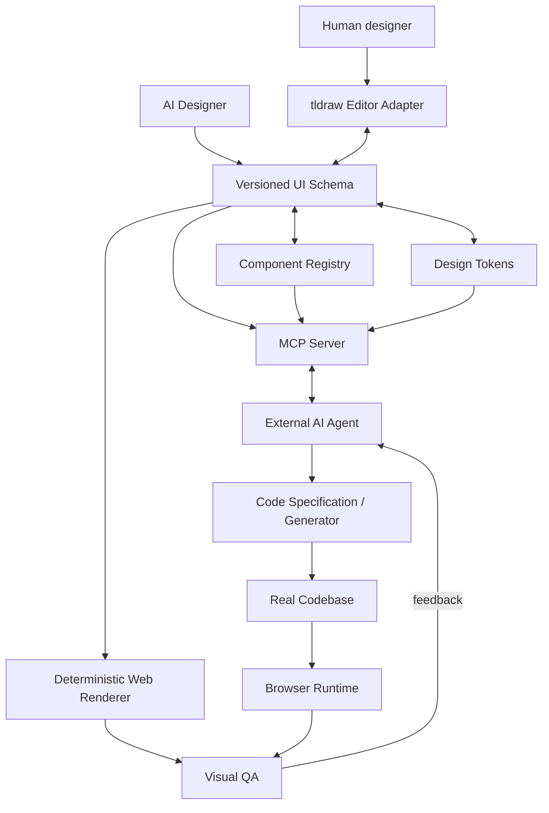

# UIForge Architecture

## 1. Architectural thesis

UIForge is a **schema-first, agent-first, renderer-independent** system.

The same UI Schema + Product Experience Graph must be able to drive:

- visual editor;
- flow/prototype canvas;
- browser preview;
- AI modification;
- MCP context;
- code generation;
- visual QA;
- future framework targets.

## 2. System diagram



## 3. Layer boundaries

### Domain

`ui-schema`, `experience-graph`, `design-tokens`, `component-registry`

`ui-schema` owns screen/node semantics. `experience-graph` owns user journeys, flows and semantic transitions between screens/nodes.

Must be browser-independent and provider-independent.

### Interaction

`editor`

Owns selection, tools, commands, canvas adapter and UI interaction.

### Presentation

`renderer`

Converts semantic schema into deterministic HTML/React preview.

### Intelligence

`ai`

Owns model calls, prompt orchestration, structured generation, normalization and AI patch generation.

### Agent integration

`mcp-server`

Exposes domain data and controlled mutations.

### Delivery

`codegen`

Converts semantic design into implementation specs and target code.

## 4. Product Experience Graph

The Experience Graph is the canonical behavioral/navigation model. It must represent:

- Flow and UserJourney;
- starting points;
- source screen/node and destination screen/node;
- trigger;
- action;
- optional condition;
- optional animation metadata;
- validation findings.

Required graph invariants include valid references, deterministic IDs, explicit destinations, deterministic reachability checks and no silent orphan/broken connections.

tldraw prototype connections are an editor projection of this graph.

## 5. UI Schema requirements

Every node must have:

- stable ID;
- semantic type;
- parent/child relationship;
- layout semantics;
- style/token references;
- content model;
- responsive rules when needed;
- accessibility semantics when interactive;
- component registry reference where applicable;
- schema version metadata.

The schema must support migration.

## 6. Layout model

The semantic layout model prioritizes:

1. stack/flow;
2. flex;
3. grid;
4. absolute positioning only when semantically justified.

Coordinates are editor metadata, not design intent.

Example:

```json
{
  "layout": {
    "mode": "grid",
    "columns": 12,
    "gap": {"token": "space.6"}
  }
}
```

## 6. Change model

AI and editor mutations should become typed operations:

```
CreateNode
UpdateNode
MoveNode
DeleteNode
SetToken
SetVariant
SetResponsiveRule
SetCodeMapping
```

Operations should be serializable for:

- undo/redo;
- audit;
- AI explanation;
- replay tests;
- future collaboration.

## 7. Versioning

Schema versions use explicit versions such as:

`uiforge.schema/v1`

Breaking changes require:

- migration;
- fixture updates;
- compatibility tests;
- changelog entry.

## 8. Persistence

Initial hosted model:

```
Supabase Auth
    ↓
Postgres
    ↓
Project
 ├── Document
 ├── Screen
 ├── TokenSet
 ├── ComponentDefinition
 ├── Asset
 ├── Version
 └── AuditEvent
```

All exposed tables must have RLS and allow/deny tests. Supabase explicitly recommends RLS for exposed tables and security tests for each operation.

## 10. Editor strategy

tldraw is an editor implementation detail.

We use custom semantic shapes where useful, but persistence must serialize to UI Schema.

This prevents a future canvas replacement from becoming a migration disaster.

tldraw already provides AI integration patterns and custom shape infrastructure suitable for visual AI applications.

## 11. Rendering strategy

The renderer must be deterministic for the same:

`schema + token set + component registry + viewport + fixture data`

This enables visual regression testing.

## 12. AI strategy

AI providers implement:

```ts
interface AIProvider {
  generateStructuredUI(input): Promise<StructuredUIResult>
  proposePatch(input): Promise<UICommand[]>
  analyzeScreenshot(input): Promise<ScreenshotAnalysis>
}
```

The domain layer never imports a provider SDK.

## 13. Code generation strategy

Do not generate code directly from pixels.

```
UI Schema
  ↓
Code Specification
  ↓
Target Adapter
  ↓
Source Files
```

MVP target:

- React 19.3;
- Next.js;
- Tailwind CSS v4;
- shadcn/ui/Base UI.

shadcn/ui is particularly compatible with this approach because it distributes open component source and explicitly positions itself as AI-ready.

## 14. MCP architecture

MCP is a public integration boundary.

Resources provide structured context; tools provide executable read/write operations. The MCP specification separates these primitives by control model.

Hosted transport:

`Streamable HTTP`

because current AI SDK guidance recommends HTTP transport for production and stdio for local servers.

## 15. Visual QA

The design preview and implementation are rendered at identical viewport/fixture settings.

Playwright `toHaveScreenshot` provides screenshot comparison. Baselines must be generated and verified in a controlled environment because browser/OS/font differences can affect pixels.

## 16. ADR rule

Architecture decisions with long-term consequences require an ADR under `docs/architecture/adr/`.

Use:

`ADR-NNN-title.md`

Minimum sections:

- Context
- Decision
- Alternatives
- Consequences
- Revisit conditions

## Official references

- MCP specification: https://modelcontextprotocol.io/specification/
- MCP TypeScript SDK: https://github.com/modelcontextprotocol/typescript-sdk
- Figma MCP: https://developers.figma.com/docs/figma-mcp-server/
- tldraw AI: https://tldraw.dev/docs/ai
- shadcn/ui: https://ui.shadcn.com/docs
- Supabase RLS: https://supabase.com/docs/guides/database/postgres/row-level-security
- Playwright snapshots: https://playwright.dev/docs/next/test-snapshots
