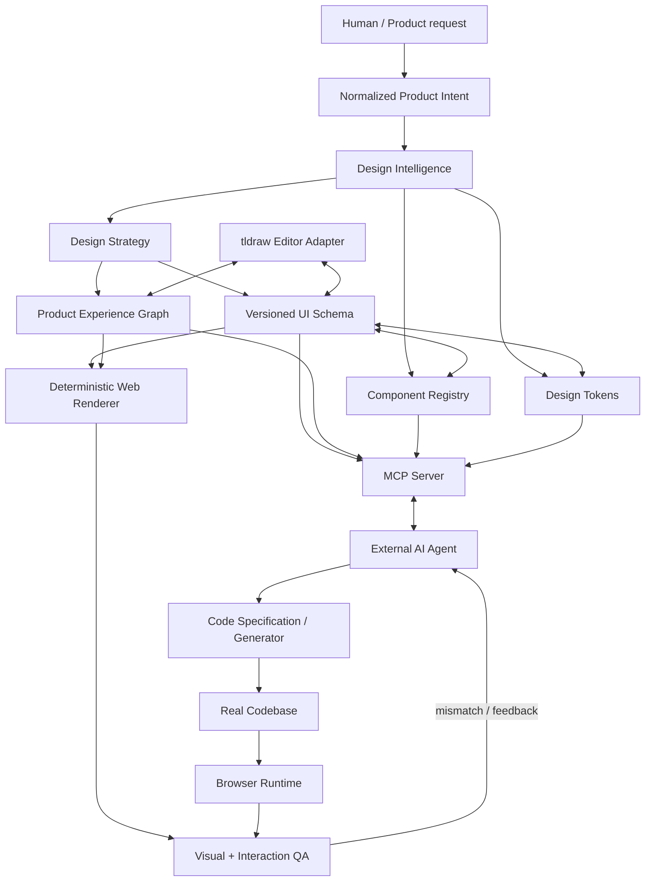

# UIForge Architecture

## 1. Architectural thesis

UIForge is a **schema-first, agent-first, renderer-independent** system.

The semantic product-design pipeline is:

`User Intent → Product Intent → Design Skill Discovery → Skill Composition → Design Strategy → UI Schema + Product Experience Graph`

The **UI Schema + Product Experience Graph** remain the canonical persisted design contracts. Design Strategy is a validated intermediate planning artifact, not a second source of truth.

The same canonical contracts must be able to drive:

- visual editor;
- flow/prototype canvas;
- browser preview;
- AI modification;
- MCP context;
- code generation;
- visual + interaction QA;
- future framework targets.

## 2. System diagram



The important separation is:

- **Product Intent** describes what the user is trying to build.
- **Design Intelligence** decides which reusable design knowledge applies.
- **Design Strategy** records the resulting plan.
- **UI Schema** describes what screens/components/layouts are.
- **Experience Graph** describes how users move and interact through the product.
- Canvas, prototype, renderer, MCP and codegen are downstream projections.

## 3. Layer boundaries

### Semantic product layer

`design-intelligence`, `ui-schema`, `experience-graph`, `design-tokens`, `component-registry`

`design-intelligence` owns the provider-independent Skill Registry, discovery/composition and Design Strategy contracts.

`ui-schema` owns screen/node semantics. `experience-graph` owns user journeys, flows and semantic transitions between screens/nodes.

The semantic layer must be browser-independent and provider-independent.

### Interaction

`editor`

Owns selection, tools, commands, canvas projection, flow visualization and editor interaction. It must read/write canonical semantic contracts through adapters, not define a competing persistence model.

### Presentation

`renderer`

Converts semantic schema/graph state into deterministic HTML/React preview.

### Intelligence

`ai`

Owns model calls, prompt orchestration, structured generation, normalization and AI patch generation.

The AI package consumes Design Strategy rather than embedding the entire design-skill catalog in provider-specific prompts.

### Agent integration

`mcp-server`

Exposes scoped semantic resources and controlled mutations.

### Delivery

`codegen`

Converts semantic design into implementation specifications and target code.

## 4. Design Intelligence

Design Intelligence is the planning layer between Product Intent and canonical design contracts.

Pipeline:

```text
User prompt
   ↓
Product Intent
   ↓
Skill Discovery
   ↓
Skill Composition
   ↓
Design Strategy
   ├── information architecture
   ├── primary navigation
   ├── user tasks
   ├── screen archetypes
   ├── component patterns
   ├── interaction patterns
   ├── responsive strategy
   ├── accessibility constraints
   └── anti-patterns
   ↓
UI Schema + Experience Graph
```

### Design Skill

A skill is reusable semantic design knowledge. It may contain:

- domain applicability;
- UX patterns;
- information-architecture patterns;
- component/layout patterns;
- interaction rules;
- responsive rules;
- accessibility rules;
- anti-patterns;
- semantic references;
- compatibility/conflict metadata;
- validation constraints;
- examples/fixtures;
- version/provenance metadata.

Skills are not merely prompt snippets.

### Discovery

Discovery receives normalized Product Intent and returns deterministic candidates with explicit matching metadata.

An internal relevance ordering may exist, but UIForge must not present a universal numeric "best UI" score. Selection must be explainable through matched domain/pattern/constraint metadata.

### Composition

Composition must be deterministic for the same:

`Product Intent + Registry version + Design-system version`

It must:

- deduplicate compatible patterns;
- detect explicit conflicts;
- resolve tested conflicts deterministically;
- preserve skill provenance;
- validate semantic references;
- serialize stably.

### Design Strategy

Design Strategy is an intermediate, versioned artifact. It must contain, at minimum:

- product/domain context;
- selected skill IDs and provenance;
- information architecture;
- primary navigation strategy;
- primary user tasks;
- screen archetypes;
- component pattern recommendations;
- interaction strategy;
- responsive strategy;
- accessibility constraints;
- anti-patterns;
- composition/validation findings.

It must not duplicate persisted screen/node state or become a hidden second source of truth.

## 5. Color Intelligence

Color is established at project initialization, before screen generation. Design Intelligence produces a versioned Color Strategy containing brand anchors, semantic roles, tonal scales, light/dark mappings, status roles and chart roles.

Pipeline:

`Product Intent → Design Strategy → Color Strategy → UI Schema + Design Tokens`

Primary and secondary are the default brand anchors. Accent is optional and requires a defined semantic purpose. The palette is shared across the project; individual screens cannot silently introduce unrelated colors.

Color generation should use a perceptual representation such as OKLCH for tonal-scale construction where supported. Accessibility validation is a hard gate for applicable contrast requirements, while harmony, saturation, accent count and surface usage are explicit UIForge heuristics rather than universal laws.

Dribbble-style palette exploration is treated as inspiration only. It may inform visual direction, but cannot override product meaning, role consistency or accessibility constraints.

## 5. Product Experience Graph

The Experience Graph is the canonical behavioral/navigation model. It must represent:

- Flow and UserJourney;
- starting points;
- source screen/node and destination screen/node;
- trigger;
- action;
- optional condition;
- optional animation metadata;
- validation findings.

Required graph invariants include valid references, deterministic IDs, explicit destinations, deterministic reachability checks and no silent orphan/broken connections.

tldraw prototype connections are an editor projection of this graph.

## 8. UI Schema requirements

Every node must have:

- stable ID;
- semantic type;
- parent/child relationship;
- layout semantics;
- style/token references;
- content model;
- responsive rules when needed;
- accessibility semantics when interactive;
- component registry reference where applicable;
- schema version metadata.

The schema must support migration.

## 7. Layout model

The semantic layout model prioritizes:

1. stack/flow;
2. flex;
3. grid;
4. absolute positioning only when semantically justified.

Coordinates are editor metadata, not design intent.

Example:

```json
{
  "layout": {
    "mode": "grid",
    "columns": 12,
    "gap": {"token": "space.6"}
  }
}
```

## 10. Change model

AI and editor mutations should become typed operations:

```text
CreateNode
UpdateNode
MoveNode
DeleteNode
SetToken
SetVariant
SetResponsiveRule
SetCodeMapping
CreateTransition
UpdateTransition
DeleteTransition
```

Operations should be serializable for:

- undo/redo;
- audit;
- AI explanation;
- replay tests;
- future collaboration.

## 11. Versioning

Schema versions use explicit versions such as:

`uiforge.schema/v1`

Breaking changes require:

- migration;
- fixture updates;
- compatibility tests;
- changelog entry.

Design Strategy and Design Skills are separately versioned and should include fixture compatibility tests.

## 12. Persistence

Initial hosted model:

```text
Supabase Auth
    ↓
Postgres
    ↓
Project
 ├── Document
 ├── Screen
 ├── Flow
 ├── UserJourney
 ├── TokenSet
 ├── ComponentDefinition
 ├── Asset
 ├── Version
 └── AuditEvent
```

All exposed tables must have RLS and allow/deny tests.

## 13. Editor strategy

tldraw is an editor implementation detail.

We use custom semantic shapes where useful, but persistence must serialize to UI Schema and Experience Graph.

This prevents a future canvas replacement from becoming a migration disaster.

## 14. Rendering strategy

The renderer must be deterministic for the same:

`UI Schema + Experience Graph + token set + component registry + viewport + fixture data`

This enables visual and interaction regression testing.

## 15. AI strategy

AI providers implement stable interfaces such as:

```ts
interface AIProvider {
  generateStructuredUI(input): Promise<StructuredUIResult>
  proposePatch(input): Promise<UICommand[]>
  analyzeScreenshot(input): Promise<ScreenshotAnalysis>
}
```

The AI execution contract should support:

```text
Input
 → Product Intent
 → Design Strategy
 → Structured generation
 → Parse
 → Schema / Graph validation
 → Normalize
 → Design-system validation
 → Typed command/patch
 → Apply
```

The domain layer never imports a provider SDK.

## 16. Code generation strategy

Do not generate code directly from pixels.

```text
UI Schema + Experience Graph + Design Strategy requirements
  ↓
Code Specification
  ↓
Target Adapter
  ↓
Source Files
```

MVP target:

- React 19.3;
- Next.js;
- Tailwind CSS v4;
- shadcn/ui/Base UI.

## 17. MCP architecture

MCP is a public integration boundary.

Resources provide structured context; tools provide executable read/write operations. The MCP specification separates these primitives by control model.

MCP should be able to expose selected design-strategy provenance and relevant skill requirements to coding agents without exposing the entire registry by default.

Hosted transport:

`Streamable HTTP`

Local development may use stdio.

## 18. Visual + Interaction QA

The design preview and implementation are rendered at identical viewport/fixture settings.

Playwright screenshot comparison verifies visual fidelity. Interaction QA should replay canonical Experience Graph journeys and detect broken/misrouted transitions.

Baselines must be generated and verified in a controlled environment because browser/OS/font differences can affect pixels.

## 19. ADR rule

Architecture decisions with long-term consequences require an ADR under `docs/architecture/adr/`.

Use:

`ADR-NNN-title.md`

Minimum sections:

- Context
- Decision
- Alternatives
- Consequences
- Revisit conditions

## Official references

- MCP specification: https://modelcontextprotocol.io/specification/
- MCP TypeScript SDK: https://github.com/modelcontextprotocol/typescript-sdk
- Figma MCP: https://developers.figma.com/docs/figma-mcp-server/
- tldraw AI: https://tldraw.dev/docs/ai
- shadcn/ui: https://ui.shadcn.com/docs
- Supabase RLS: https://supabase.com/docs/guides/database/postgres/row-level-security
- Playwright snapshots: https://playwright.dev/docs/next/test-snapshots## 7. Visual Craft Quality

Visual quality is a semantic system, not an aesthetic afterthought.

The Visual Craft layer consumes Design Strategy, Color Strategy and component decisions, then applies project-wide rules for:
- typography hierarchy and responsive type ramps;
- spacing rhythm and component density;
- card anatomy and usage;
- iconography family/weight/size;
- radius and elevation;
- responsive composition;
- visual anti-pattern detection.

Pipeline:

`Design Strategy + Color Strategy → Component Decision → Visual Craft Strategy → UI Schema + Design Tokens → Render`

The visual layer must distinguish:
- normative accessibility constraints;
- UIForge design heuristics;
- product-specific visual direction;
- inspiration references.

It must never collapse these into a subjective "beauty score".

### Typography

UIForge defines semantic desktop/mobile type roles for web products. Each role includes size and line-height. Screens use roles rather than raw font sizes.

### Spacing and density

Use a 4px base rhythm with semantic spacing tokens. Density is contextual: compact, standard and spacious. The same Card component can legitimately use different density tiers depending on information density and product strategy.

### Iconography

The default web icon provider is SVG-based Lucide through an icon registry. The semantic model stores icon IDs, while rendering resolves them to SVG. Icon family, optical weight and size remain consistent across the product.

Interactive hit area is a component concern and may be larger than the visible SVG.

### Card craft

Cards are optional composition primitives, not universal wrappers. Visual Craft should detect repeated generic card anatomy and recommend alternatives such as sections, list rows, inline panels or table rows when a card adds no grouping or interaction value.

### Anti-AI lint

The Visual Craft validator should detect suspiciously generic patterns including:
- card spam;
- raw/unregistered font sizes;
- inconsistent line-height;
- random spacing;
- mixed icon families;
- non-SVG UI icon assets;
- inconsistent icon sizes/weights;
- excessive radius/elevation;
- oversized headings;
- missing mobile type adaptation;
- decorative visual noise without semantic purpose.

Findings are deterministic, explainable and tied to semantic IDs/rule IDs.

## 6. Component Intelligence and Design Agents

Component Intelligence sits below Design Strategy and above UI Schema generation. Its job is to choose the concrete component, variant, state and interaction contract for a semantic context.

```text
Design Strategy
      ↓
Design Agent Orchestrator
      ↓
Discover relevant skills
      ↓
Component decision
  ├── component
  ├── variant
  ├── state
  ├── responsive presentation
  ├── accessibility requirements
  └── interaction / Experience Graph requirements
      ↓
Validation
      ↓
Typed UI command / patch
```

The agent model follows the useful architectural ideas of reusable agents and on-demand skills: a primary orchestrator delegates bounded specialist work, skills are loaded only when relevant, and permissions/capabilities restrict what each specialist can do. Review specialists are read-only. This is a semantic product architecture, not a copy of OpenCode's runtime/config format.

Recommended roles:
- information architect;
- UX pattern designer;
- component designer;
- visual designer;
- responsive designer;
- accessibility reviewer;
- interaction reviewer;
- design critic.

Do not persist private chain-of-thought. Persist concise Decision Records containing the chosen component/pattern, affected semantic IDs, rule/skill provenance, constraints checked and validation result.

Component choice precedence is:

`Accessibility/security → project design-system rules → explicit product requirements → Experience Graph semantics → component/skill rules → visual heuristics → aesthetic inspiration`

This makes the agent's behavior reproducible while allowing explicit exceptions.


