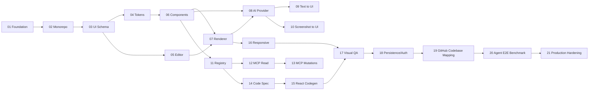

# UIForge Roadmap

## Dependency graph

## Phase 0 — Foundation

### Goal

Make the repository safe for autonomous implementation.

Outputs:

- README;
- AGENTS;
- architecture;
- research;
- CI;
- coding/test conventions;
- issue templates.

## Phase 1 — Semantic UI Core

### Goal

Create the canonical UI representation.

Outputs:

- schema v1;
- validator;
- migration strategy;
- token engine;
- component model;
- deterministic fixtures.

## Phase 2 — Visual Editor

### Goal

Make the schema visually editable.

Outputs:

- tldraw adapter;
- layer tree;
- property panel;
- component insertion;
- selection;
- undo/redo;
- responsive viewport controls.

## Phase 3 — AI Design

### Goal

Generate and modify schema safely.

Outputs:

- AI provider abstraction;
- structured generation;
- text-to-UI;
- screenshot-to-UI;
- patch application;
- validation.

## Phase 4 — Agent Bridge

### Goal

Make UIForge useful to external coding agents.

Outputs:

- MCP resources;
- read tools;
- mutation tools;
- capability/security model;
- contract tests.

## Phase 5 — Design-to-Code

### Goal

Produce implementation-ready specifications and code.

Outputs:

- code mapping;
- React/Tailwind/shadcn target;
- code specification;
- code generator;
- compile verification.

## Phase 6 — Visual Quality

### Goal

Close the design-to-code feedback loop.

Outputs:

- deterministic preview;
- browser renderer;
- Playwright screenshots;
- visual diff;
- mismatch report;
- auto-fix proposals.

## Phase 7 — Persistence

### Goal

Make UIForge a real hosted product.

Outputs:

- auth;
- project storage;
- revisions;
- assets;
- RLS;
- audit logs.

## Phase 8 — Codebase Intelligence

### Goal

Map designs to real project components instead of generating duplicates.

Outputs:

- GitHub integration;
- component discovery;
- code mapping suggestions;
- import graph;
- registry synchronization.

## Phase 9 — Production

### Goal

Operate safely at real-user scale.

Outputs:

- rate limiting;
- observability;
- cost controls;
- security review;
- backup/recovery;
- deployment;
- launch checklist.

## Milestones

### M0 — Repository ready

No product functionality required.

### M1 — First editable UI

Text fixture → schema → canvas → preview.

### M2 — AI UI

Prompt → editable UI with validated schema.

### M3 — MCP demo

External agent reads a screen and component registry.

### M4 — Design-to-code demo

External agent implements React screen using mapped components.

### M5 — Visual QA loop

Design vs implementation mismatch is detected and reported.

### M6 — Hosted alpha

Projects, auth, revisions and assets work.

### M7 — Agent-native beta

GitHub mapping + visual QA + stable MCP integration.

## Definition of milestone success

A milestone requires real runtime evidence, not only source code or unit tests.
